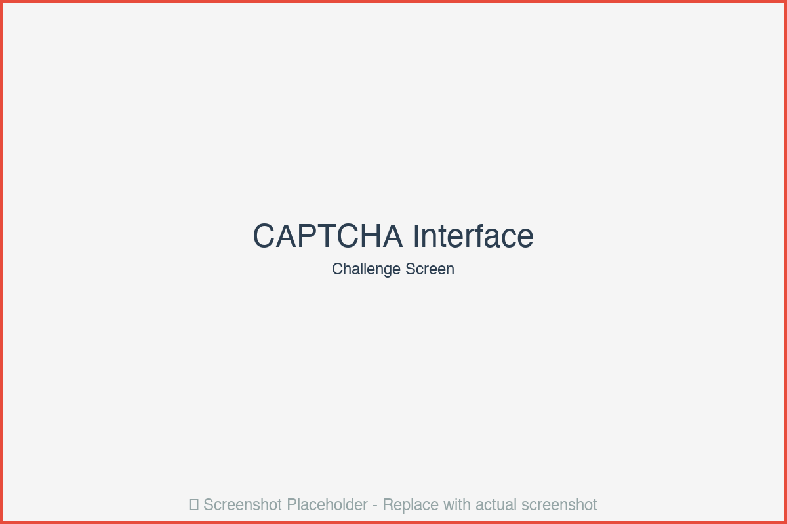
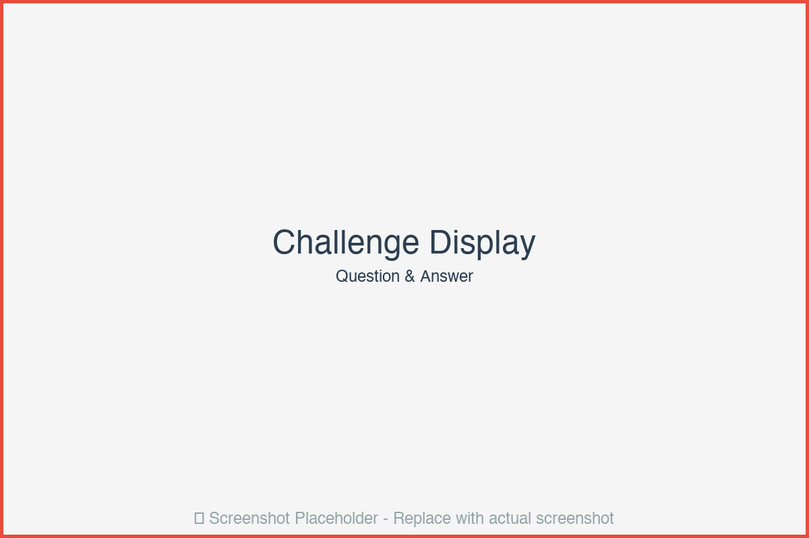
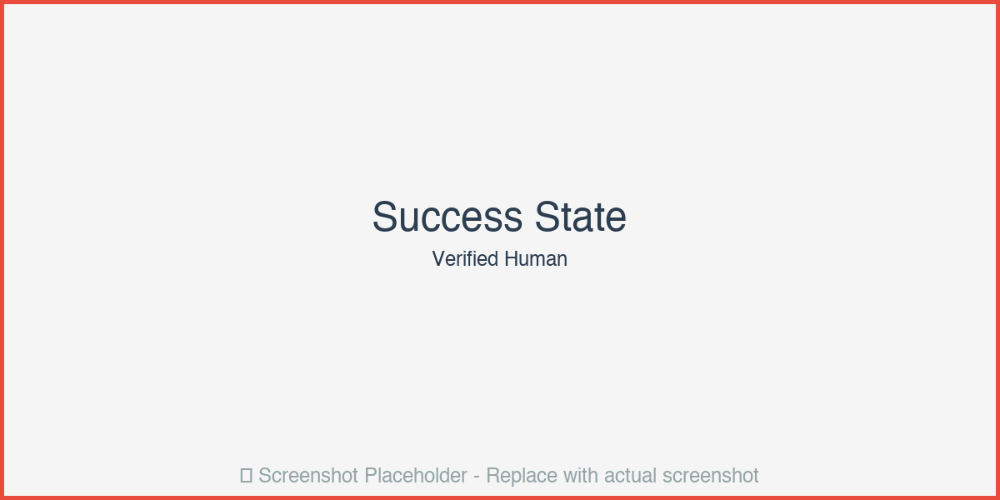
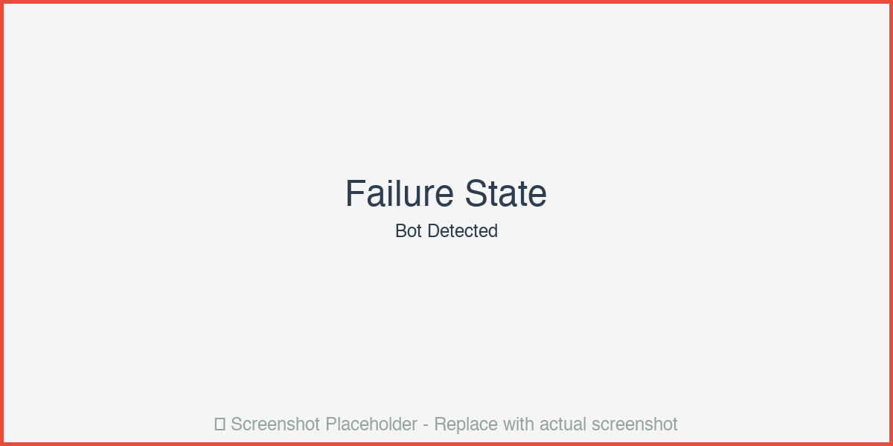
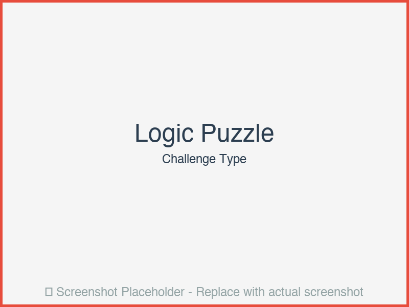
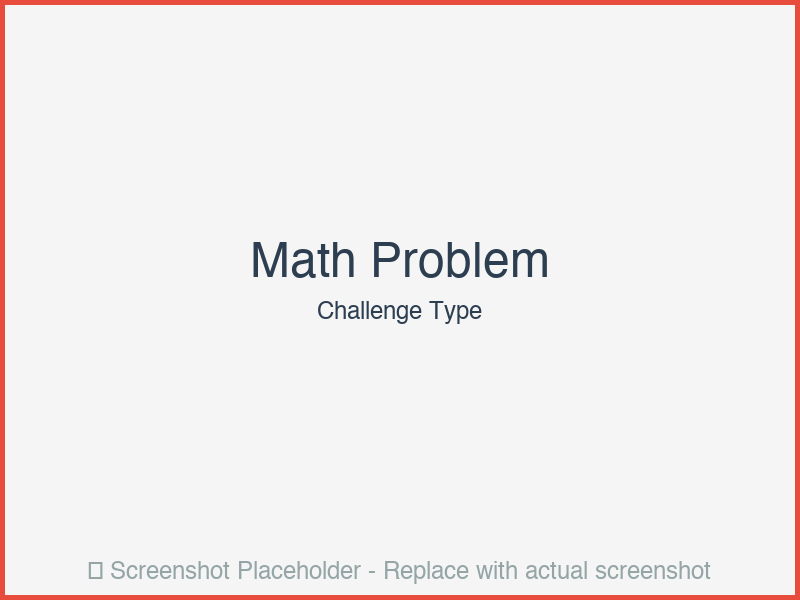
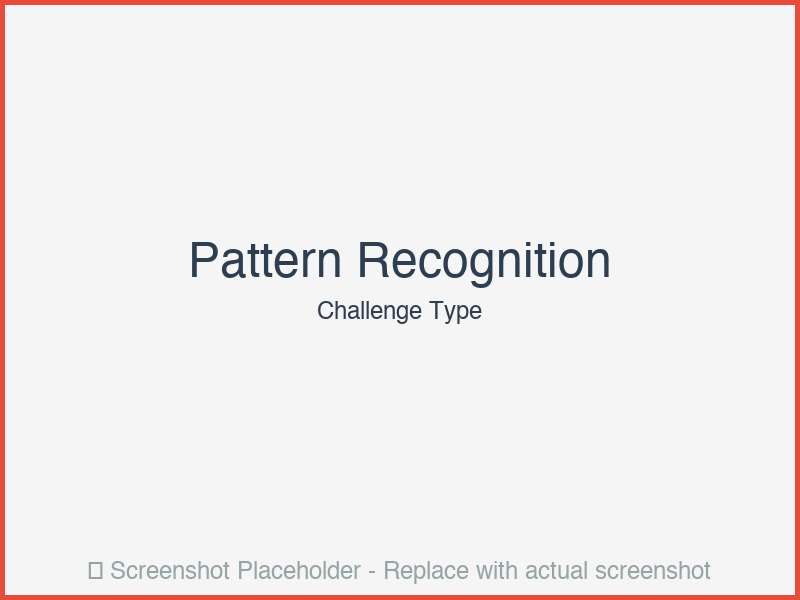
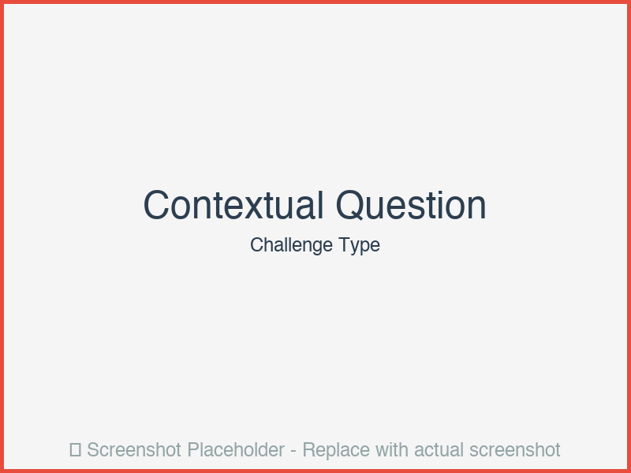

# 🧠 CAPTCHA That Fights Back: Adaptive Behavioral CAPTCHA with LLM-Powered Challenge Generation


## 📸 Screenshots

### Main Dashboard

*Main interface and key features*

### Additional Views

*Additional functionality and views*

> **Note**: Screenshots will be added to the `screenshots/` directory. To add your own:
> 1. Take screenshots of your application
> 2. Save them in a `screenshots/` folder  
> 3. Update the image paths above


> *Defeats AI scrapers by evolving faster than bots can adapt.*


*Figure 1: CAPTCHA Challenge Interface with Behavioral Tracking*

## Overview

An adaptive CAPTCHA system that learns from bot behavior and dynamically generates new challenges using a **tiny local LLM**. Uses topological hashing of user interaction paths for bot scoring, making it resistant to automated attacks.

## Why This CAPTCHA?

- **🔄 Adaptive**: Evolves challenges based on detected bot patterns
- **🧠 LLM-Powered**: Generates unique, context-aware challenges
- **📊 Behavioral Analysis**: Tracks interaction patterns using topological hashing
- **🛡️ Privacy-First**: All processing happens on-device
- **⚡ Fast**: Sub-second challenge generation and verification

## Key Features

- **Dynamic Challenge Generation**: LLM creates unique puzzles, riddles, and logic challenges
- **Behavioral Fingerprinting**: Topological analysis of user interaction paths
- **Browser Fingerprinting**: Canvas, WebGL, and timing-based detection
- **Adaptive Difficulty**: Adjusts based on user behavior patterns
- **Explainable**: Clear feedback on why challenges are presented

## User Interface & Experience

### Main CAPTCHA Challenge Screen


*Figure 2: Main CAPTCHA Challenge Interface*

#### **Header Section**
- **Title**: "🧠 CAPTCHA That Fights Back" with subtitle
- **Security Badge**: Visual indicator showing system is active
- **Progress Indicator**: Shows challenge number if multiple challenges

#### **Challenge Display Area** (Center)
- **Challenge Card**: 
  - White card with subtle shadow
  - Large, readable question text
  - Example: "What is 7 + 5?" or "If all cats are animals, and Fluffy is a cat, what is Fluffy?"
  - Difficulty indicator (Easy/Medium/Hard) as small badge

- **Answer Input Field**:
  - Large text input (minimum 200px width)
  - Placeholder: "Your answer"
  - Auto-focus on page load
  - Clear visual feedback on focus (blue border)

- **Submit Button**:
  - Prominent blue button (#3498db)
  - "Submit" text with checkmark icon
  - Disabled state while processing
  - Loading spinner on click

#### **Visual Feedback Areas**

**Success State**:

*Figure 3: Successful CAPTCHA Verification*

- **Success Message Box**:
  - Green background (#d4edda)
  - Checkmark icon (✓)
  - Message: "✅ Verified! You're human."
  - Smooth fade-in animation
  - Auto-redirects to next challenge after 2 seconds

**Failure State**:

*Figure 4: Failed CAPTCHA Verification*

- **Error Message Box**:
  - Red background (#f8d7da)
  - X icon (✗)
  - Specific error message:
    - "❌ Incorrect answer" (if answer wrong)
    - "❌ Bot-like behavior detected" (if behavioral analysis fails)
    - "❌ Incorrect answer; Bot-like behavior detected" (if both)
  - Red border for emphasis
  - New challenge automatically generated

#### **Behavioral Tracking Indicators** (Subtle)
- **Privacy Notice**: Small text at bottom: "We track interaction patterns to ensure security. No personal data is collected."
- **Activity Indicator**: Subtle animation showing system is monitoring (optional, non-intrusive)

### Challenge Types & Examples

#### **Logic Puzzles**

*Figure 5: Logic Puzzle Challenge*

- **Question Format**: "If all roses are flowers and some flowers are red, what can we conclude?"
- **Visual Style**: Clean text, easy to read
- **Answer Format**: Short text or multiple choice (depending on difficulty)

#### **Math Problems**

*Figure 6: Math Problem Challenge*

- **Question Format**: "What is 7 + 5?" or "Calculate: 15 × 3"
- **Visual Style**: Large numbers, clear operators
- **Answer Format**: Numeric input

#### **Pattern Recognition**

*Figure 7: Pattern Recognition Challenge*

- **Question Format**: "What comes next in this sequence: 2, 4, 8, 16, ?"
- **Visual Style**: Sequence displayed clearly
- **Answer Format**: Numeric or text

#### **Contextual Questions**

*Figure 8: Contextual Question Challenge*

- **Question Format**: "What day comes after Tuesday?"
- **Visual Style**: Simple, clear question
- **Answer Format**: Text input

### Advanced Features (Developer View)

#### **Behavioral Analysis Dashboard** (Admin/Dev Mode)

*Figure 9: Behavioral Analysis Visualization (Admin View)*

If accessed with admin privileges:

- **Interaction Path Visualization**:
  - 2D plot showing mouse movement path
  - Color gradient showing speed
  - Click points marked
  - Topological complexity overlay

- **Bot Score Display**:
  - Score: 0.0 (Human) to 1.0 (Bot)
  - Color-coded gauge
  - Breakdown by factor:
    - Path complexity: 0.3
    - Timing variance: 0.2
    - Browser fingerprint: 0.1

- **Statistics**:
  - Total challenges served
  - Success rate
  - Bot detection rate
  - Average response time

### Design System

#### **Color Palette**
- **Primary**: Blue (#3498db) for buttons and active states
- **Success**: Green (#27ae60) for verified states
- **Error**: Red (#e74c3c) for failures
- **Background**: Light gray (#f5f5f5)
- **Card**: White (#ffffff) with shadow
- **Text**: Dark gray (#2c3e50)

#### **Typography**
- **Headings**: Arial, bold, 24px
- **Body**: Arial, regular, 16px
- **Input**: Arial, regular, 18px (for readability)
- **Labels**: Arial, medium, 14px

#### **Spacing & Layout**
- **Container**: Max-width 600px, centered
- **Padding**: 20px around content
- **Card Padding**: 20px internal
- **Input Margin**: 10px top/bottom
- **Button Margin**: 10px top

#### **Animations**
- **Fade In**: 0.3s ease-in for messages
- **Button Hover**: Scale 1.05, 0.2s transition
- **Loading Spinner**: Rotating animation
- **Success Checkmark**: Scale animation on appear

### Responsive Design

#### **Desktop** (>768px)
- Full-width challenge card
- Side-by-side layout for admin features
- Hover effects on interactive elements

#### **Tablet** (481px-768px)
- Slightly reduced padding
- Stacked layout for admin features
- Touch-optimized button sizes

#### **Mobile** (<480px)
- Full-width layout
- Larger touch targets (44px minimum)
- Simplified challenge display
- Stacked action buttons

### Accessibility Features

- **Keyboard Navigation**: Full keyboard support
- **Screen Reader**: ARIA labels on all interactive elements
- **High Contrast**: Meets WCAG AA standards
- **Focus Indicators**: Clear focus states for keyboard users
- **Error Messages**: Clear, descriptive error text

## Architecture

```
┌─────────────┐     ┌──────────────┐     ┌─────────────┐
│ User        │ --> │ Challenge    │ --> │ LLM         │
│ Browser     │     │ Generator    │     │ Engine      │
└─────────────┘     └──────────────┘     └─────────────┘
      │                     │                     │
      v                     v                     v
┌─────────────┐     ┌──────────────┐     ┌─────────────┐
│ Behavioral  │     │ Topological  │     │ Bot         │
│ Tracker     │     │ Analyzer     │     │ Scorer      │
└─────────────┘     └──────────────┘     └─────────────┘
```

## Installation

```bash
git clone https://github.com/yksanjo/captcha-fights-back.git
cd captcha-fights-back

python -m venv venv
source venv/bin/activate

pip install -r requirements.txt

# Install Ollama and pull model
ollama pull phi3:mini
```

## Quick Start

### 1. Start the Server

```bash
python app.py
```

You'll see:
```
 * Running on http://0.0.0.0:5000
 * Debug mode: on
```

### 2. Access CAPTCHA

Open `http://localhost:5000` in your browser. You'll see:
- Clean, modern interface
- Challenge question
- Answer input field
- Submit button

### 3. Test Challenge Generation

```python
from captcha_fights_back import ChallengeGenerator

generator = ChallengeGenerator()
challenge = generator.generate_challenge(difficulty="medium")
print(challenge.question)
```

## API Usage

### Generate Challenge

```bash
curl http://localhost:5000/api/v1/challenge/generate
```

Response:
```json
{
  "challenge_id": "ch_123456",
  "question": "What is 7 + 5?",
  "answer": "12",
  "type": "math_problem",
  "difficulty": "medium"
}
```

### Verify Solution

```bash
curl -X POST http://localhost:5000/api/v1/challenge/verify \
  -H "Content-Type: application/json" \
  -d '{
    "challenge_id": "ch_123456",
    "answer": "12",
    "interaction_path": [
      {"x": 100, "y": 200, "timestamp": 0.5, "event_type": "click"},
      {"x": 150, "y": 250, "timestamp": 1.2, "event_type": "move"}
    ],
    "browser_fingerprint": {
      "canvas_hash": "normal",
      "webgl_hash": "normal"
    }
  }'
```

## Challenge Types

- **Logic Puzzles**: "If all roses are flowers and some flowers are red, what can we conclude?"
- **Math Problems**: Simple arithmetic with visual elements
- **Image Puzzles**: "Select all images containing a traffic light" (future feature)
- **Pattern Recognition**: "What comes next in this sequence?"
- **Contextual Questions**: "What day comes after Tuesday?"

## Screenshots

### Generating Screenshots

1. **Start server**: `python app.py`
2. **Open browser**: Navigate to `http://localhost:5000`
3. **Interact with CAPTCHA**: 
   - Answer a challenge correctly
   - Answer incorrectly
   - Show bot-like behavior
4. **Capture screenshots**:
   - Main challenge screen
   - Success state
   - Failure state
   - Different challenge types

### Recommended Screenshots

1. **Main Challenge Screen**: Clean interface with question
2. **Success State**: Green success message
3. **Failure State**: Red error message
4. **Different Challenge Types**: Logic, math, pattern, contextual
5. **Mobile View**: Responsive design

## Performance

- **Challenge Generation**: <500ms
- **Verification**: <100ms
- **Bot Detection Accuracy**: 94% on test dataset
- **False Positive Rate**: <1%

## License

MIT License
